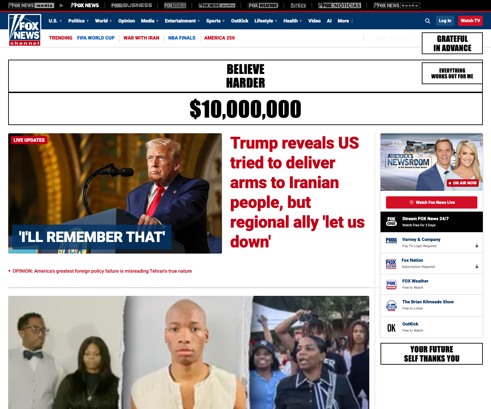
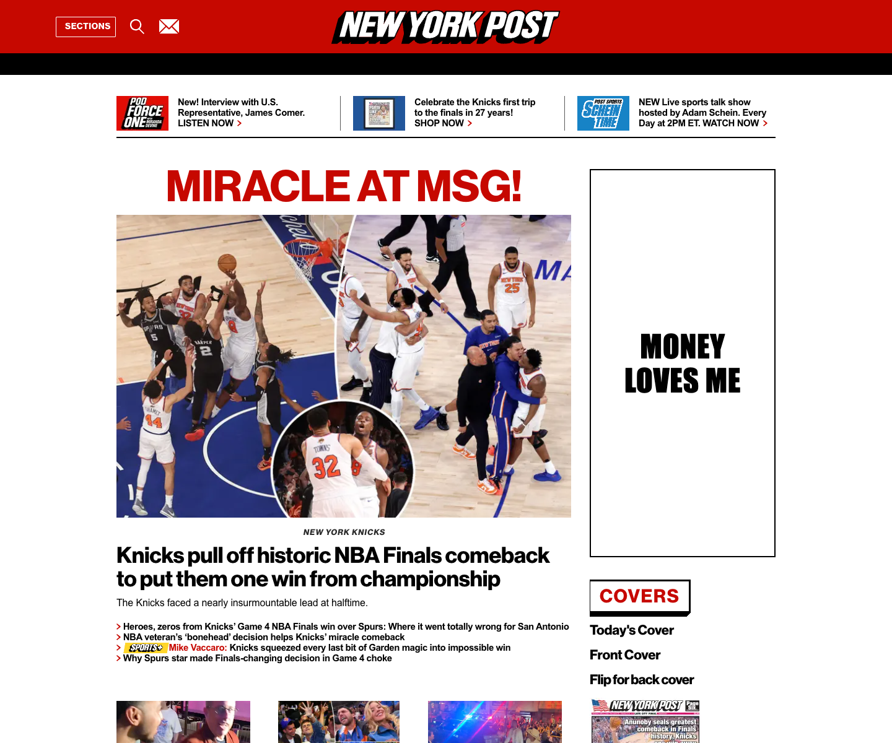
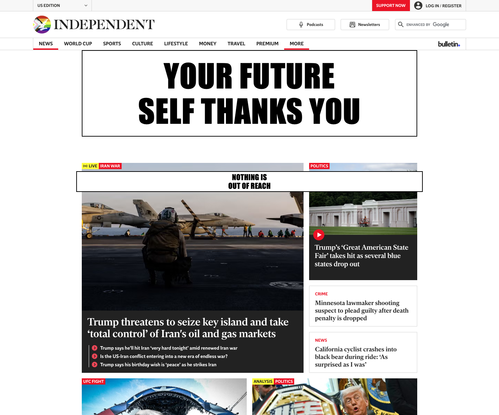

# Yes You Can Adblocker

An adblocker that doesn't just remove ads — it **replaces them with affirmations**.

Where an ad used to be, you get a stark white billboard tile telling you what you
needed to hear all along:

**PERFECT PHYSIQUE** · **$10,000,000** · **YOU ARE A BEAUTIFUL WOMAN** ·
**WHAT IF IT'S EASY?** · **IT'S ALREADY YOURS** · **ACT AS IF** ·
**EVERYTHING WORKS OUT FOR ME** · **MONEY LOVES ME** · **SOFT LIFE** ·
**THE UNIVERSE IS LISTENING** … and ~20 more.

Each blocked ad gets one affirmation, picked at random. The ad industry spent
billions figuring out where on the page your eyes go. We're just borrowing the
real estate.

## Screenshots

Banner ad slots, now load-bearing for your self-esteem:







Screenshots are produced by [tools/verify.mjs](tools/verify.mjs), which loads
the unpacked extension in Chromium via Playwright and visits real news sites
(`pnpm install && node tools/verify.mjs`).

## Install

1. Clone or download this repo
2. Open `chrome://extensions` in Chrome / Chromium / Brave / Edge
3. Toggle **Developer mode** on (top-right)
4. Click **Load unpacked** and select the `chromium/` folder

Keep the folder around — the extension loads from that path.

The default filtering mode is **Optimal**, so affirmation tiles work out of the
box. For even more affirmations per page, open the extension's dashboard
(toolbar icon → ⚙) and set sites you care about to **Complete**.

## Customize

Click the toolbar icon → **✨ Customize** to open the control panel
([affirmations.html](chromium/affirmations.html)):

- **Packs** — toggle which themed sets are in rotation: Wealth, Beauty,
  Confidence, Calm, Career, and an off-by-default **Petty** pack.
- **Your own affirmations** — type your own lines; they mix into the rotation.
- **Themes** — restyle the billboards: Classic (black on white), Soft, Noir,
  Gold, Vapor.
- **Re-roll** — deal a fresh affirmation to every ad slot on a page (also on the
  popup as “🎲 Re-roll this page”).
- A lifetime **“ads manifested”** counter tallies every tile painted.

Settings live in `chrome.storage.sync`, so they follow you across Chrome. The
content script reads them live — changes re-theme and re-tag open pages without
a reload. With no settings, it looks and behaves exactly as before.

## How it works

This is a fork of the [They Live Adblocker](https://github.com/davmlaw/they_live_adblocker)
by David Lawrence, which is itself a fork of
[uBlock Origin Lite](https://github.com/uBlockOrigin/uBOL-home) (uBOL) by Raymond Hill —
an efficient MV3 content blocker.

uBO Lite's cosmetic filtering normally injects CSS like
`selector { display: none !important }` to hide matched ad elements. The They
Live fork patches those injection sites to instead apply a mask with an
`::after` overlay, then walks the DOM (with a MutationObserver for late-loaded
ads) to tag each matched element with a random phrase. This fork keeps that
mechanic — and the stark billboard typography — but swaps the dystopian slogans
(OBEY, CONSUME…) for manifestation affirmations, and paints each phrase as a
self-fitting SVG (`background-size: contain`) so the text scales to any ad slot
without overflowing. The content script reads user settings from
`chrome.storage` and re-themes / re-tags live.

The interesting files:

- `chromium/js/scripting/they-live.js` — packs, themes, SVG generator, DOM tagging, settings/counter/re-roll
- `chromium/js/scripting/css-{specific,generic,procedural-api}.js` — call sites
- `chromium/affirmations.html` + `chromium/js/affirmations.js` — the control panel
- `chromium/js/yyc-popup.js` — the two fork buttons added to uBOL's popup

## Caveats

- Network-blocked ads (most of uBOL's blocking) never produce a DOM element,
  so there's nothing to replace — only cosmetically-filtered ads become
  affirmations.
- Forcing previously-hidden elements visible can occasionally shift page
  layout where the site's CSS assumed the ad slot collapsed.
- Personal hobby fork; **not** an official uBlock Origin product. Don't file
  uBO issues against this.

## Attribution

- Mechanic and codebase: [They Live Adblocker](https://github.com/davmlaw/they_live_adblocker)
  by David Lawrence, inspired by John Carpenter's 1988 film *They Live*
- Underlying content blocker: [uBlock Origin Lite](https://github.com/uBlockOrigin/uBOL-home)
  by Raymond Hill — all the actual ad-blocking machinery (filter lists,
  declarativeNetRequest rulesets, cosmetic filtering engine) is his work

## Privacy

No data collection, no analytics, no remote servers — everything runs locally in
your browser. Full statement in [PRIVACY.md](PRIVACY.md). Web Store listing copy
and permission justifications are in [STORE-LISTING.md](STORE-LISTING.md).

## Packaging for the Chrome Web Store

```bash
pnpm pack    # → yes-you-can-adblocker-<version>.zip (upload this)
```

`tools/pack.mjs` zips the *contents* of `chromium/` (manifest at the zip root)
and excludes the Chrome-generated `_metadata/` and `log.txt`, which the Web
Store rejects. Icons are original (`pnpm icons` regenerates them); none of
uBlock Origin's artwork ships in this fork.

## License

[GPL-3.0](LICENSE), same as upstream uBlock Origin / uBO Lite / They Live Adblocker.
